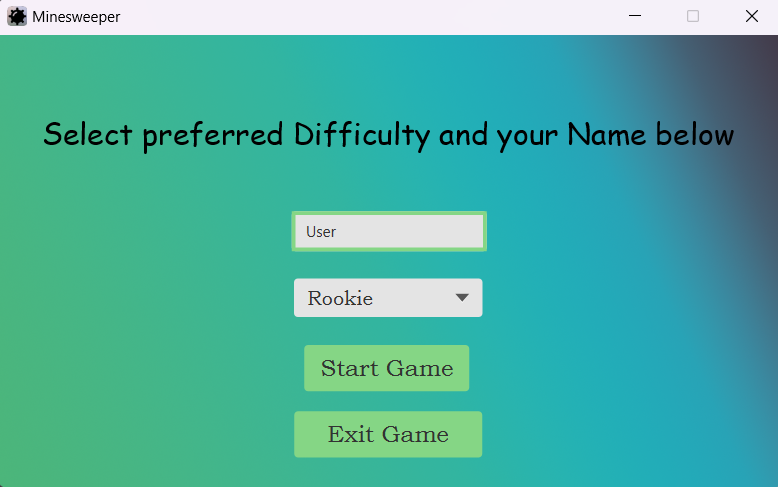
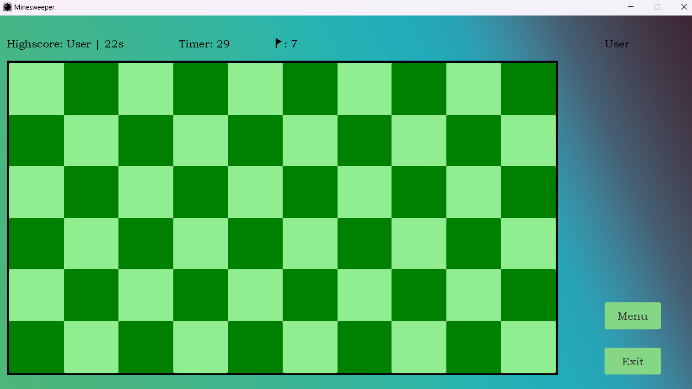
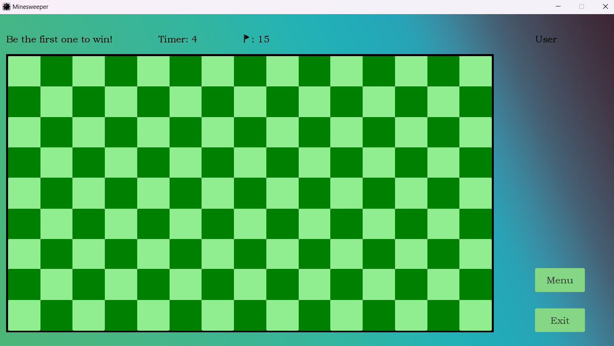
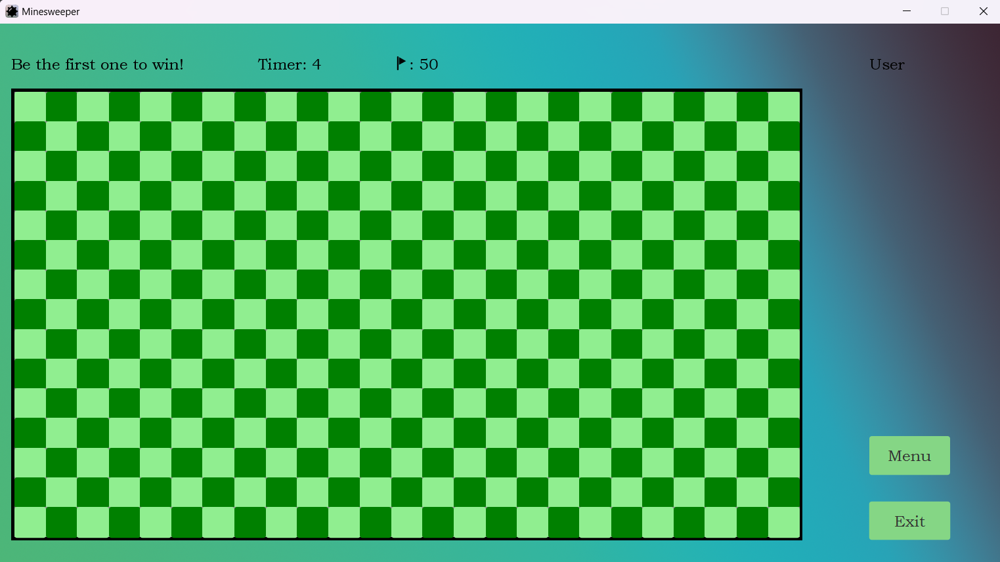
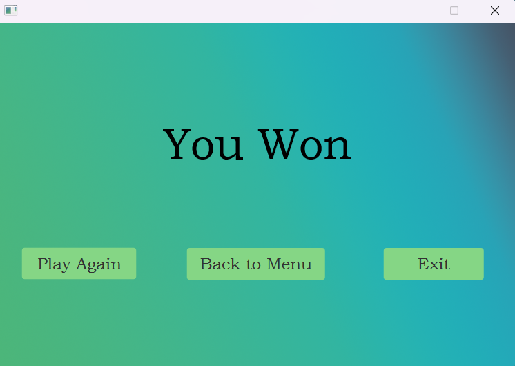
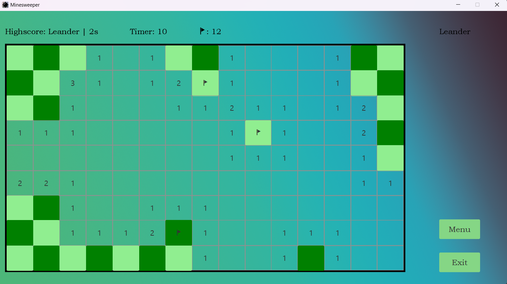

# Minesweeper
A Minesweeper Application with varianting levels of difficulty, made in JavaFX by lmikota.

## Featuring
 - **Start Screen & End Screen**
 - **Difficulty Selection**: Choose from Rookie, Intermediate, or Master.
 - **Highscore**: Automatically saves and displays the best score for each difficulty.
 - **Timer**: A timer, tracking the time for each game.
 - **Flagcount**: Remaining Flags get displayed.

## How to Play
1. Select a difficulty in the ChoiceBox and choose your username or keep it default.
2. Click on the Start-Button to start the game.
3. Left-click to reveal Fields
4. Right-click to place a flag.
5. Clear the board without hitting mines to win!
6. If you win faster than any other user, your highscore is saved.

## Menu Options
### Start-screen
 - **Choicebox**: Choose difficulty
 - **Textfield**: Choose your gamer-tag
 - **Start Button**: Starts the game :^)
 - **Exit Button**: Closes the application

### Ingame
 - **Exit Buton**: Closes the application

### End-screen
 - **Play Again Button**: Restarts the Game with the previous difficulty
 - **Back to Menu**: Opens the Start-screen and closes the End-screen
- **Exit Button**: Closes the application

## Screenshots
### Start-Screen

### Rookie

### Intermediate

### Master

### End-Screen

### While playing

## Author
Leander Mikota from HTL-Steyr